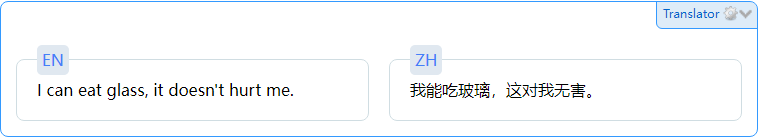

# GD-Translator - AI Translator as GoldenDict Extension

This is a Python AI Translator designed as an extension for [GoldenDict](https://github.com/goldendict/goldendict). This tool leverages LLM API (e.g., OpenAI API) to provide seamless and accurate translations.

## Getting Started

First, install this package.

```
pip install .
```

Then, create a configuration file in YAML format with the following structure:

```yaml
server:
  api_key: "sk-*************"
  base_url: "https://api.openai.com/"
  model: "model-name"
  price:
    input: 1e-6
    output: 2e-6
  lock_file_path: '/path/to/lock/file/path'
```

- api_key: This is typically a unique key provided by the service you are using (e.g., OpenAI). You need to replace "sk-*************" with your actual API key. Make sure to keep the key secure and not share it publicly.
- base_url: The base_url is the base URL of the API endpoint you are interacting with. Replace "https://api.openai.com/" with the actual base URL of the API service you are using.
- model: Replace "model-name" with the name of the model you want to use.
- price: If the application involves pricing for input and output, adjust the values of input and output under price according to the pricing policy provided by the service.
- lock_file_path: Modify the lock_file_path to point to the actual path where the lock file should be stored on your system.

Open `Edit > Dictionaries > Programs`, add an entry with `Type` as `Html`, choose a name you like for `Name`, and set `Command Line` to

```
/path/to/python/interpreter -m gdtranslator %GDWORD% --config "/path/to/config.yaml"
```

You should be able to use the translator then.


## Demo

